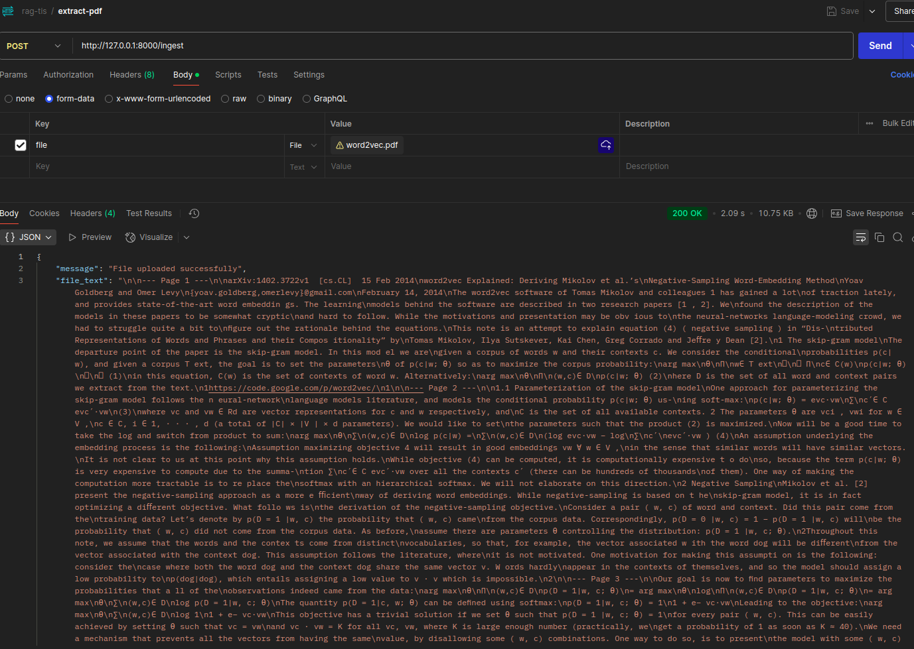
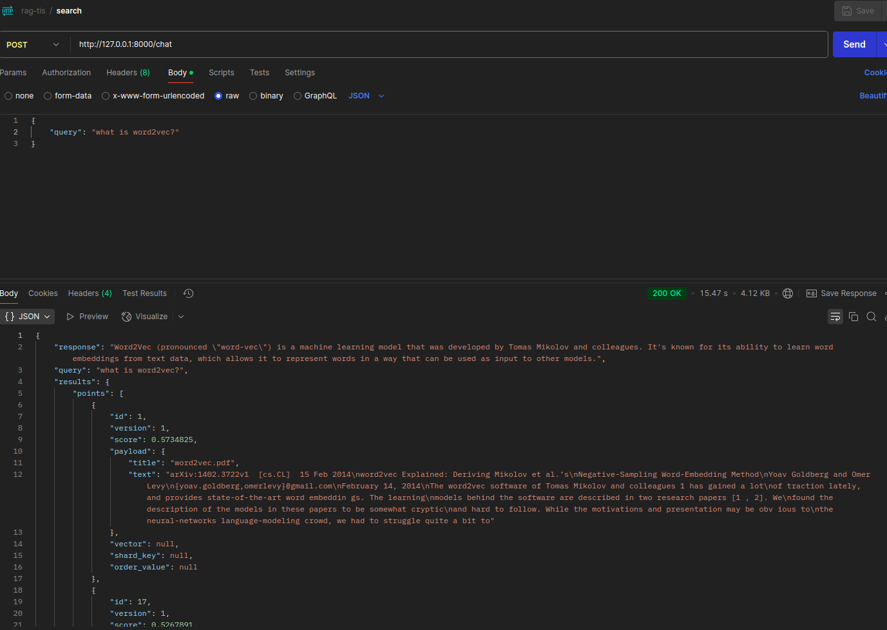

# Setup
Makesure that you already installed on your server or local
- python
- docker
- docker compose

# How to Run
For running the app you can just simply use the following command on your terminal

```
docker compose up --build
```

The command above will build the docker image and run the container. There are three services that will be running, the first one is the app service which is the main service that will run the app, the second one is the db service which is the qdrant service that will run the qdrant, and the third one is the ollama service which is the model service that will run the ollama.

In this project I use `qwen2.5:0.5` as the model for the ollama service. You can change the model by changing it in the `entrypoint` field under the `ollama` service in the `docker-compose.yml` file.

After running the command above, you can access the app by going to `http://localhost:8000` on your browser. You can also access the qdrant dashboard by going to `http://localhost:6333` and the ollama dashboard by going to `http://localhost:11434`.

There are two endpoints that you can use to interact with the app:
-  the first one is the `/ingest` endpoint which is used upload, extract, and save the embedding of pdf document
-  the second one is the `/chat` endpoint which is used to chat with the app about the document that you have uploaded.

## How to Ingest PDF Document
Here’s an example of how the request should look in Postman:
- **Method**: `POST`
- **URL**: `http://localhost:8000/ingest`
- **Body**:
  - `form-data`:
 - Key: `file`
 - Value: (Upload your PDF file)

Here's an example of the response that you will get:
 

 ## How to Chat with the App
Here’s an example of how the request should look in Postman:
- **Method**: `POST`
- **URL**: `http://localhost:8000/chat`
- **Body**:
  - `raw`:
  - **JSON**:
    ```json
    {
    "query": "What is the main topic of the document?"
    }
    ```

Here's an example of the response that you will get:


# Architecture

For this app, I use the following architecture:
- The app is built using FastAPI which is a modern web framework for building APIs with Python.
- The app uses Qdrant as the vector database to store the embeddings of the PDF documents.
- The app uses Ollama as the model service to run the language model for answering the queries about the PDF documents.
- The app uses Docker to containerize the application and its dependencies, making it easier to deploy and run on any environment.

